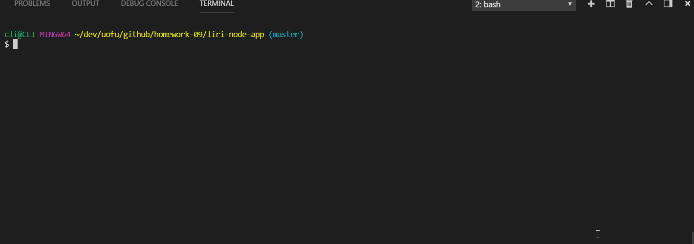

# liri-node-app

## App Demo GIF

### Description

This assignment asks us to create a javascript file that can input arguments within a node command line to access three different APIs (omdb, spotify, and twitter).

The demo shows the different commands that can be entered:
* spotify-this-song
    * default behavior
    * and with a specific track title
* movie-this
    * defaul behavior
    * and with a specific movie title
* my-tweets
* do-what-it-says

The first two commands are self-explanatory, accessing information for either a default song/movie, or for a specified one. Spotify requires client key and secret, which will need to be provided in an .env file by the user of the repository. While the demo only shows titles entered in quotes, logic has been written in so that multiple-word songs and movie titles can be entered without quotes.

The twitter command requests the latest tweets from the profile provided in the .env file (something a user needing to use this repository will have to provide themselves).
The final command reads the **random.txt** file and runs the command inside the file. Currently, the file runs a spotify-this-music command for a Keane song. This can be changed by the user as desired. _It does not currently handle multiple commands._

Last but not least, all the outputs are not only logged to console, but appended via fs to a **log.txt** file (if such file does not exist, a new file will be created).

### Example of valid commands
We will use node.js to run the javascript file. The following are some examples what a valid command line input looks like:
* node liri.js spotify-this-song "99 Red Balloons"
* node liri.js spotify-this-song House of Gold
* node liri.js spotify-this-song
* node liri.js my-tweets
* node liri.js movie-this "Mr. Nobody"
* node liri.js movie-this "Lion King"
* node liri.js movie-this Die Hard
* node liri.js movie-this
* node liri.js do-what-it-says